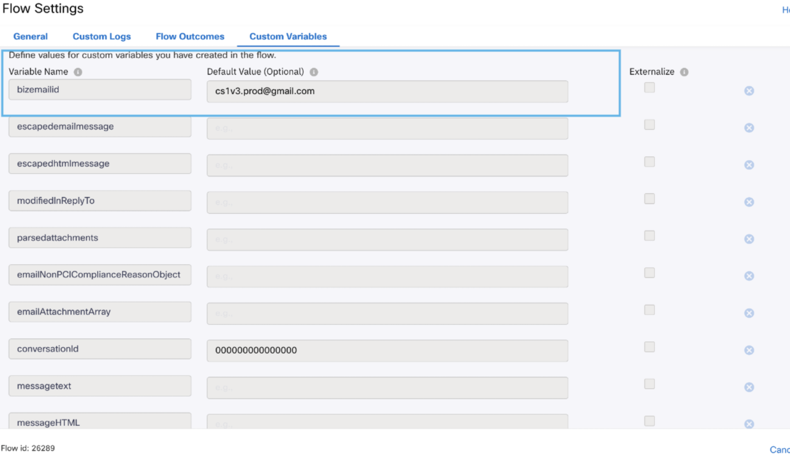

# Media Specific Workflows

This repo provides the template workflows for Webex Contact Center and IMI integration.

## Workflows Overview
The following workflow templates are included :

**Media Specific Workflows** : These flows need to be imported once per asset of the specific channel.
* **Facebook Inbound Flow** - This workflow will be triggered for every inbound customer message over the integrated Facebook page.
* **Live Chat Inbound Flow** - This workflow will be triggered for every inbound customer message over the configured customer chat widget, and the widget has a live chat form configured.
* **Live Chat Inbound Flow Without Form** - This workflow will be triggered for every inbound customer message over the configured customer chat widget and the widget doesn't have a live chat form configured.
* **SMS Inbound Flow** - This workflow will be triggered for every inbound customer sms sent over the integrated SMS phone number.
* **Email Inbound Flow** - This workflow will be triggered for every inbound customer email to the integrated email account.
* **Whatsapp Inbound Flow** - This workflow will be triggered for every inbound customer message over the integrated whatsapp business number.
* **Live Chat Close Flow** - This workflow will be triggered when a livechat customer has ended the chat.

Note : 
- Queue selection from queue task node is mandatory for any channel flows before making flow live.
- Flow variables must be updated in the setting section with the correct asset details.

## Updating Flow Variables

Flow Variables that need to be updated under Custom Variables for different channels: -
- LiveChat :- appId,liveChatDomain

  

- Facebook :- FBpageid,appid

  
  
- Whatsapp :- WANumber,appid

  

- Email    :- bizemailid

  

### Live Chat Inbound Flow Details
- In the Live Chat Flow, we need to select the template. For creation of template refer to https://help.imiconnect.io/docs/livechat-template
Sample template is shown in below image

  

- In the Live Chat/In App messaging node we have selected the message type as form and we have to choose the template from the dropdown which has the list of all the livechat templates available in that tenant

  

- In this sample we have filled the template as LiveChatTemplate(the sample one shown in above image)

  

- In the Receive node transition action we need to set the variable customerName and customerEmail and this customerName and customerEmail will 
be visible on the agent desktop.

- We are getting the value for customerName and customerEmail from the livechat form. In the given sample livechat template the customername and customeremail
field in form is 'Name' and 'Email' so we are filling it as `$(n2438.inappmessaging.formFields.Name)` and `$(n2438.inappmessaging.formFields.Email)` respectively.
If you will give some other variable name for the name and email field then you need to update the flow accordingly. Let's say you are giving form field as UserName and
UserEmail then you need to set the variables in the Receive node Transition Actions as `$(n2438.inappmessaging.formFields.UserName)` and `$(n2438.inappmessaging.formFields.UserEmail)`

  

## Quick start on Workflows

* Follow the process for Organization setup in WxCC with IMI Integration.
* Download the sample flow template from the repository.
* Import the flows in your Webex Connect service.
* Add authorizations at integration level.
* For Resolve Conversation node flow id needs to be updated manually. Flow id can be obtained from the address bar. For example flow id (41896) can be obtained from the url https://testorg.datacenter.webexconnect.io/flowdesigner/flow/v3/flowView?flowId=41896
* Modify the flows as per your use case.
* Make flows live with the configured assets.

Details of this material is available in Webex Connect platform documentation.
* Login to your Webex Connect account.
* Click `Documentation` under `Help` section.
* Click on `Documentation` under `Help` section.
* Webex Connect platform documentation will open in a new tab.
* Webex Connect platform documentation will open in a new tab.
* Under `Getting Started`, click `Webex Connect Platform Overview`.
* Under `GETTING STARTED` click on `Webex Connect Platform Overview`.
* Scroll down to the `Webex Contact Center and Webex Connect Integration` section.
* Scroll down to `CISCO WEBEX CONTACT CENTER AND Webex CONNECT INTEGRATION` section.
* Click `Overview`.
